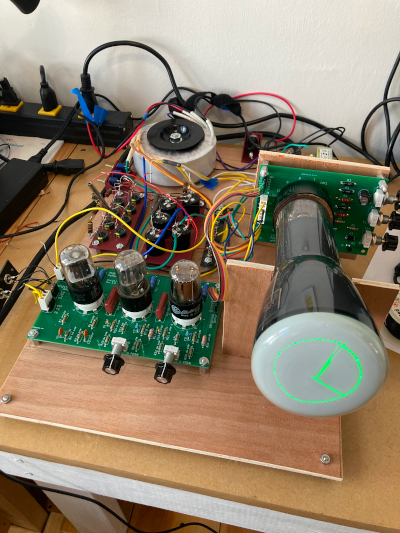

# Oscilloscope Clock

OK, time to jump on the oscilloscope clock bandwagon!
It's an old idea, but they just look so cool.

* [Wiki Page](http://hertz.bu.edu/~hazen/wiki/en/#!mdwiki/ScopeClock.md)

This was going to be a simple clone of some rather simplistic
transistor-based designs around the internet, but now I've got
something more ambitious in mind!  Here's the prototype in action:

## Hardware

* 3BP1(A) CRT with proper drive to +360/-1400V [pcb](https://github.com/eshazen/scope-clock/tree/main/hardware/anderson_crt)
* Tube-based deflection circuit using 6SN7 or 12SN7 dual triodes [pcb](https://github.com/eshazen/scope-clock/tree/main/hardware/deflection_amp)
* Voltage-multiplier HV supply using an Antek transformer
* Display-list based vector graphics generator (or could cheat and use a uC)

## Attribution

The CRT circuit is directly inspired by Steve Anderson's narrow-bandwidth TV (NBTV) monitor design, as found at https://www.taswegian.com/NBTV/forum/index.php.

**Status**

**2022-12-28** - more or less working.  Hand-wired high voltage
supply.  CRT PCB and deflection amp working with only a couple of tiny
issues.

Open issues:

* Deflection amp gets quite non-linear at around 60% deflection (-1600V on CRT).  At -800V it's fine.  Low end of diff output leg is around 250V.  The range 250-320 works well.
* If you switch off all the supplies together the CRT arcs inside (oops!).  Need to shut down the -1500V first and wait many seconds, then turn off the others.  Really need to figure out some sort of shutdown circuit
* The input has to be driven by a laptop.

