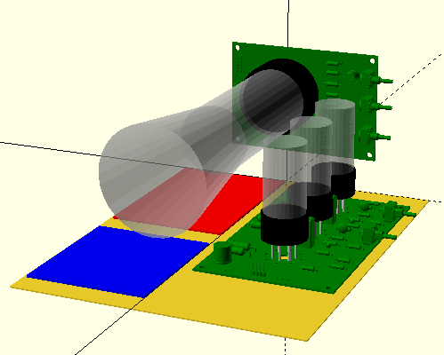

# Oscilloscope Clock

OK, time to jump on the oscilloscope clock bandwagon!
It's an old idea, but they just look so cool.

* [Wiki Page](http://hertz.bu.edu/~hazen/wiki/en/#!mdwiki/ScopeClock.md)

This was going to be a simple clone of some rather simplistic
transistor-based designs around the internet, but now I've got
something more ambitious in mind!

## Hardware

* 3BP1(A) CRT with proper drive to +360/-1400V [pcb](https://github.com/eshazen/scope-clock/tree/main/hardware/anderson_crt)
* Tube-based deflection circuit using 6SN7 or 12SN7 dual triodes [pcb](https://github.com/eshazen/scope-clock/tree/main/hardware/deflection_amp)
* Voltage-multiplier HV supply using an Antek transformer
* Display-list based vector graphics generator (or could cheat and use a uC)

**Status** -- CRT, transformer, PCBs for CRT and deflection amp are on the way!

## Software

Display the time (of course) but also various text:  weather, notifications, etc.
This thing could work as a computer peripheral with a serial interface or
maybe WiFi.

Games?  Maybe https://www.nycresistor.com/2013/06/08/spacerocks/

